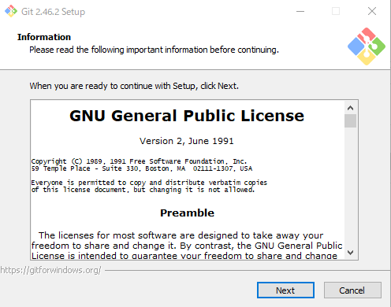
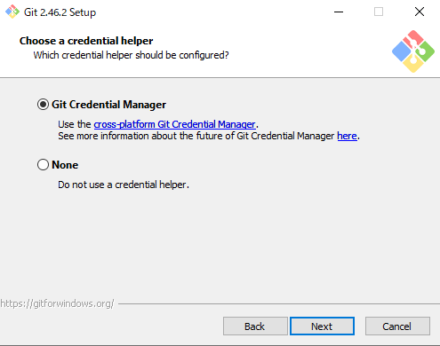
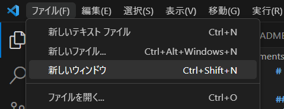
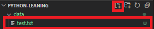

# Githubの使い方

## Gitとは
Gitはソースコードやファイルのバージョン管理システムである。Gitでできることを以下に挙げる。

* ファイルの変更履歴の管理<br>
いつ、だれが、ファイルのどこを編集したかを管理することができる。

* バージョンの管理<br>
ソフトウェアを作成するとき、複数のバージョンの管理ができる。

* 過去のファイルに戻す（変更の取り消し）<br>
間違った編集は取り消すことができる。

* チームでファイルや変更履歴を共有
Gitはネットワークを経由して、複数人でファイルや変更履歴を共有する機能もある。

## Githubとは
Gitの編集履歴を共有したり、管理したりできるサービス。<br>
[https://github.co.jp/](https://github.co.jp/)

## 覚えておいたほうが良いGit用語

* リポジトリ - Git内でファイルを保存できるスペース。
* クローン - リポジトリをコピーすること。
* コミット - Gitにファイルの編集履歴を登録し、更新すること。
* インデックス- どの編集したファイルをコミットするかインデクスに登録する必要がある。
* プッシュ - Githubなどのオンライン上にあるリポジトリに自分のリポジトリの変更内容を送信すること。
* プル - Githubなどのオンライン上にあるリポジトリから自分のリポジトリに変更内容をダウンロードすること。
* ブランチ - 変更履歴を分割すること。
* マージ - 分割したブランチを統合すること。
* プルリクエスト - マージする際にほかの人の意見や同意を得るためのリクエスト

## github使用のための環境構築
### gitインストール
[git公式サイト](https://git-scm.com/downloads)からosにあったインストーラーをダウンロードする。

インストーラーを起動し、[next]を押す。



インストール場所を確認し、[next]を押す。


[next]を押す。


[next]を押す。


`Use Visuak Studio Code as Git's default editor.`を選択し、[next]を押す。


2番目の項目を選択し、[next]を押す。


[next]を押す。


[next]を押す。


[next]を押す。


[next]を押す。


[next]を押す。


[next]を押す。


[next]を押す。



[next]を押す。


[install]を押すとインストールが始まる


以下の画面が表示されればインストール完了


### githubアカウント作成

[github公式サイト](https://github.co.jp/)から「GitHubに登録する」ボタンをクリックし、必要事項を入力しアカウントを作成する。

入力したメールアドレスにメールが届くので、届いた番号で認証する。

### VSCodeとの連携

VSCodeを開き、新しいターミナルを開く。


GitHubのアカウント情報をコマンドで入力する。
```bash
git config --global user.name {自分の名前}
git config --global user.email {メールアドレス}
```

## Githubから自分のPCにリポジトリをクローンする
VSCodeで新しいウィンドウを開く。すでにVSCodeを開いている場合は、\[ファイル\] > \[新しいウィンドウ\] から開ける。



つぎに、ソース管理タブからリポジトリのクローンをクリックする。


表示されたウィンドウに
```
https://github.com/NU-TSLab/python-leaning.git
```
を入力し、エンターキーを押す。エクスプローラーが表示されるので任意の作業フォルダに保存をする。

リポジトリを開きますかと同意画面が出るので、開くを選択する。

これでローカルのPCにリポジトリのクローンが行えた。

## ブランチを発行する
自分の学習用にブランチを作成する。ブランチを作成することをブランチを発行するという。

まずソース管理タブのメニューから \[チェックアウト先\]を選択する。


表示されたウィンドウの\[新しいブランチの作成...\]をクリック。


表示されたウィンドウにブランチ名を入力する。今回は自分の苗字をローマ字にしたものとする。
ブランチ名を入力しエンターキーを押すと「ブランチを発行」というボタンが出現するのでクリックする。


以上でブランチが作成できる。

## コミット
自分専用のブランチができたので、試しにファイルを編集しコミット(編集履歴を登録)してみる。

dataフォルダの下にtest.txtを作成する。



できたテキストファイルに
```
Hello world!
```
と記載し、保存する。

ソース管理タブに移動すると、「変更」の下に追加したtest.txtがあるので、プラスアイコンをクリックする。


test.txtが「ステージされている変更」に移ればインデクスできている。このインデクスされたファイルの変更点のみ更新されるので、まだ記載途中や変更を保存したくないファイルはインデクスせずにコミットする。

次にコミットを行う。メッセージの部分に変更の要旨を書き込む。今回は「テストファイルの追加」と入力する。次に、「コミット」と表示されている青いボタンをクリックするもしくは、メニューから\[コミット\]>\[コミット\]をクリックする。


これでコミットが行えた。

## プッシュ
コミットで登録した変更履歴はまだ自分のPCのみに記録されているので、Github上にプッシュを行い記録する。メニューから\[プル、プッシュ\]>\[プッシュ\]をクリックする。


これで、Github上に変更を記録できた。[Githubのwebページ](https://github.com/NU-TSLab/python-leaning)を開き、自分のブランチの変更が適応されていることを確認する。

図の赤い部分を選択すると閲覧するブランチを変更できる。


## プル

Github上の変更は自動的にローカルのPCに反映されないので自分で更新する必要がある。これをプルという。

メニューから\[プル、プッシュ\]>\[プル\]をクリックすることでプルができる。


* [もどる](./README.md)